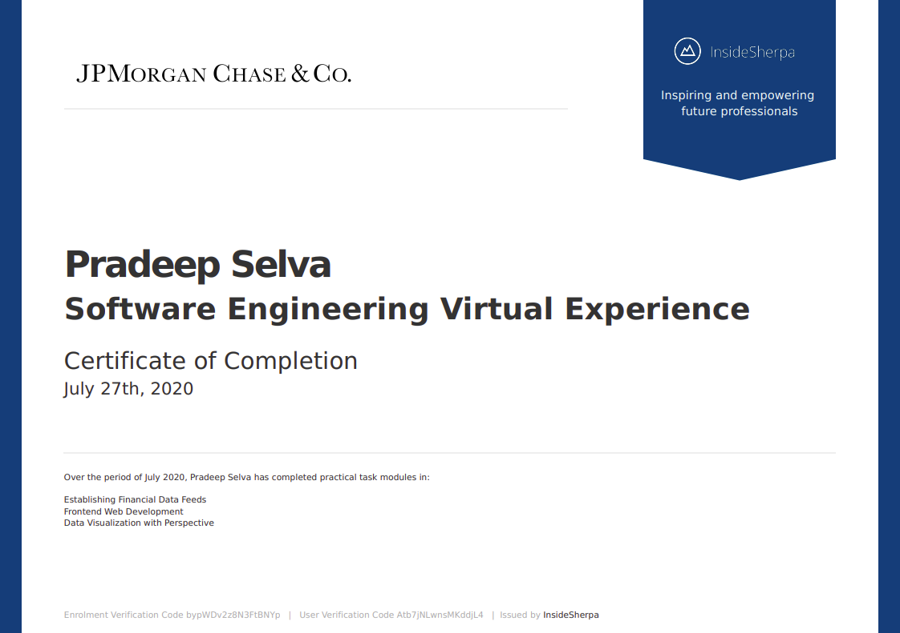

# JP Morgan & Chase, Software Engineering Virtual Experience

This repo consists of my submissions to the virtual experience programme offered my JP Morgan & Chase

### Task 1

Used python to fix errors in a HTTP server to interface with stock price data feed and set up system for data analysis

### Task 2

Used react and typescipt to implement the perspective open source code for data visualization.

### Task 3

Used perspective to create a trader's dashboard chart

